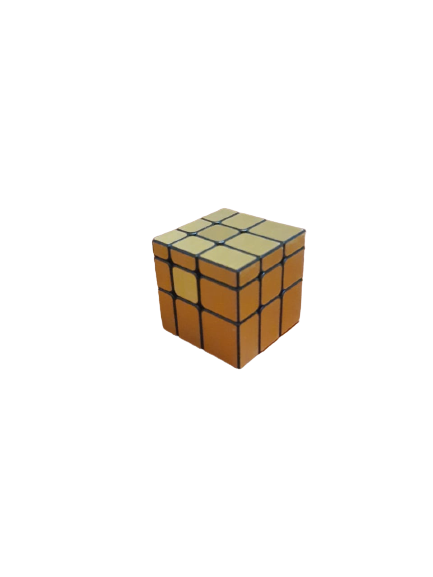

# Blockchain
.jpg)
#### Blockchain is decentralized, immutable digital ledger that stores the transactional records. 

#### Blockchain is made up of multiple blocks which stores one transactional records. These Blocks has 3 sub-parts `Previous Block Hash`, `Transaction Details` and `Block Hash`. 

Every Block includes its previous block by it Hash, so if you want to change any entry or block you have to calculate AES hash not only for that block but for all subsequent blocks, and for this you need faaastesst computers in the world becasue you need to do this before new Block add to chain and second thing if somehow you manage to change data of transaction then whole blockchain will show an error because hash will be change for next blocks.....so, it's next to impossible to tamper with blocks

#### Here is a simple Command-Line-interface based program with MySQL which shows How Blocks are connected to each other by showing its `previous hash`, `Details of Transaction` and `Current Block Hash`. 